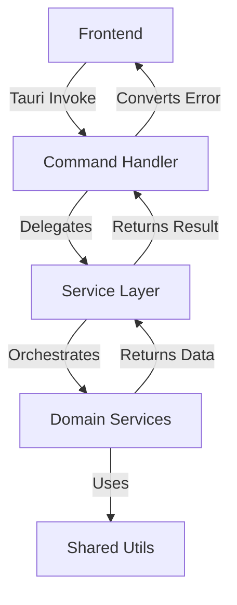
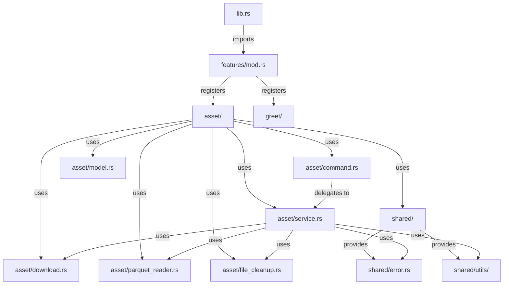

# Architecture

## Frontend

### Structure

```
src/
├── main.tsx          # React entry point
├── App.tsx           # Root component
├── features/         # Feature modules (chart, performance)
├── shared/           # Shared code
│   ├── ui/           # UI component library
│   ├── theme/        # CSS theme system
│   ├── hooks/        # Custom React hooks
│   ├── services/     # Service layer
│   ├── utils/        # Utility functions
│   ├── helpers/      # Helper functions
│   └── fonts/        # Font assets
└── docs/             # Documentation
```

### Patterns

#### Component Structure

UI components follow a consistent structure:
- `Component.tsx` - Component implementation
- `Component.module.css` - CSS Module styles (dash-case naming)
- `index.ts` - Public API exports

Example: `shared/ui/Button/Component.tsx` exports `Button`, styled with `Component.module.css`.

#### Feature Organization

Features are isolated in `features/` directory. Each feature module is self-contained.

#### Theme System

CSS custom properties organized in `shared/theme/`:
- `variables.css` - Design tokens (colors, spacing, breakpoints, etc.)
- `defaults.css` - Base styles
- `attributes.css` - Data attribute styles
- `animation.css` - Animation definitions
- `fonts.css` - Font declarations
- `globals.css` - Main entry point (imports all above)

#### Styling

- **CSS Modules** for component-scoped styles
- **Dash-case** naming for CSS class names
- **clsx** for conditional class merging
- **CSS custom properties** for design tokens

#### Type System

Shared type definitions in `shared/ui/types.ts`:
- Design tokens: `Gap`, `Padding`, `Margin`, `Shape`, `Bordered`
- Layout: `Direction`, `InlineAlign`, `BlockAlign`
- Animation: `Animation`, `AnimationDuration`, `AnimationDelay`
- Typography: `Heading`, `TextAlign`

#### Path Aliases

`@/` alias maps to `src/` for imports:
- `@/shared/theme/globals.css`
- `@/shared/ui/types`

### Tech Stack

- **React 19** + **TypeScript**
- **Vite** - Build tool
- **CSS Modules** - Component styling

---

## Backend

### Structure

```
src-tauri/src/
├── main.rs              # Entry point (binary)
├── lib.rs               # Library entry point
├── features/            # Feature modules
│   ├── mod.rs          # Feature registry
│   ├── asset/          # Asset feature module
│   │   ├── mod.rs      # Module exports
│   │   ├── command.rs  # Tauri command handlers
│   │   ├── service.rs  # Business logic orchestration
│   │   ├── model.rs    # Data models and DTOs
│   │   ├── download.rs # Domain-specific download service
│   │   ├── file_cleanup.rs # Domain-specific cleanup service
│   │   └── parquet_reader.rs # Domain-specific parquet service
│   └── greet/          # Greet feature module
│       ├── mod.rs      # Module exports
│       ├── command.rs  # Tauri command handlers
│       └── service.rs  # Business logic
└── shared/             # Shared code
    ├── mod.rs          # Shared module registry
    ├── error.rs        # Application error types
    └── utils/          # Reusable utilities
        ├── mod.rs      # Utils module registry
        ├── cache_dir.rs # Cache directory management
        ├── validation.rs # Validation utilities
        └── zip_extract.rs # File extraction utilities
```

### Feature/Module Architecture

The backend follows a **feature/module oriented architecture** where each feature is a self-contained module with clear separation of concerns.

#### Module Structure

Each feature module follows a standard structure:

1. **`mod.rs`** - Module entry point that:
   - Declares all submodules
   - Re-exports public APIs (commands) for use in the feature registry

2. **`command.rs`** - Thin command handler layer:
   - Contains Tauri command handlers marked with `#[tauri::command]`
   - Handles request/response conversion
   - Converts `AppError` to `String` for Tauri compatibility
   - Delegates business logic to service layer

3. **`service.rs`** - Business logic orchestration:
   - Contains service structs (typically with static methods)
   - Orchestrates domain-specific services
   - Handles high-level business workflows
   - Returns `Result<T, AppError>`

4. **`model.rs`** - Data models and DTOs:
   - Defines data structures with `serde` serialization
   - Contains DTOs for API communication
   - Configuration structs
   - Result types

5. **Domain-specific modules** - Additional modules for complex features:
   - Specialized services (e.g., `download.rs`, `parquet_reader.rs`)
   - Domain-specific logic separated for maintainability

#### Module Registry Pattern

Features are centrally registered in `features/mod.rs`:

```rust
pub mod greet;
pub mod asset;

pub use greet::greet;
pub use asset::{
    pull_assets,
    pull_asset_by_symbol,
    list_symbols,
    retrieve_asset_ochl,
};
```

The `lib.rs` file imports from the features module and registers commands with Tauri:

```rust
use features::{
    greet,
    pull_assets,
    pull_asset_by_symbol,
    list_symbols,
    retrieve_asset_ochl,
};

tauri::generate_handler![
    greet,
    pull_assets,
    pull_asset_by_symbol,
    list_symbols,
    retrieve_asset_ochl
]
```

#### Request Flow



#### Module Dependencies



### Patterns

#### Command Handler Pattern

Command handlers are thin wrappers that:
- Accept Tauri command parameters
- Convert errors from `AppError` to `String` for Tauri
- Delegate to service layer
- Return serializable results

Example from `features/asset/command.rs`:

```rust
#[tauri::command]
pub async fn pull_assets() -> Result<AssetOperationResult, String> {
    AssetService::pull_assets()
        .await
        .map_err(|e| e.message)
}
```

**Key characteristics:**
- Marked with `#[tauri::command]` attribute
- Return `Result<T, String>` (Tauri requirement)
- Use `.map_err(|e| e.message)` to convert `AppError` to `String`
- Async support for I/O operations

#### Service Layer Pattern

Services orchestrate business logic and coordinate domain-specific services:

**Structure:**
- Service structs with static methods (e.g., `AssetService`)
- Methods return `Result<T, AppError>`
- Orchestrate multiple domain services
- Handle high-level workflows

Example from `features/asset/service.rs`:

```rust
pub struct AssetService;

impl AssetService {
    pub async fn pull_assets() -> Result<AssetOperationResult, AppError> {
        // Orchestrates: DownloadService, FileCleanupService, etc.
    }
}
```

**Separation of concerns:**
- **Commands** → Handle Tauri-specific concerns (error conversion, serialization)
- **Services** → Orchestrate business logic
- **Domain Services** → Handle specific domain operations (download, parsing, etc.)

#### Model/Data Layer Pattern

Models define data structures for the feature:

**Location:** `features/{feature}/model.rs`

**Responsibilities:**
- Data structures with `serde` serialization
- DTOs for API communication
- Configuration structs
- Result types

Example from `features/asset/model.rs`:

```rust
#[derive(Debug, Clone, Serialize, Deserialize)]
pub struct AssetOperationResult {
    pub success: bool,
    pub message: String,
}

pub struct AssetRepoConfig {
    pub owner: String,
    pub repo: String,
    pub branch: String,
}
```

**Key characteristics:**
- Use `Serialize` and `Deserialize` for JSON communication
- Provide helper methods (e.g., `success()`, `error()`)
- Configuration structs with `Default` implementation

#### Error Handling Pattern

Consistent error handling across the application using `AppError`:

**Location:** `shared/error.rs`

**Structure:**
```rust
#[derive(Debug, Clone, Serialize, Deserialize)]
pub struct AppError {
    pub message: String,
    pub code: Option<String>,
}
```

**Usage pattern:**
1. Services return `Result<T, AppError>`
2. Command handlers convert `AppError` to `String` for Tauri
3. Error propagation through `?` operator
4. Consistent error messages across features

**Error conversion in commands:**
```rust
.map_err(|e| e.message)  // Convert AppError to String
```

**Benefits:**
- Consistent error format
- Easy error propagation
- Optional error codes for programmatic handling
- Serializable for frontend communication

#### Shared Code Organization

Shared code is organized in the `shared/` directory:

**Structure:**
```
shared/
├── mod.rs          # Module registry
├── error.rs        # Application error types
└── utils/          # Reusable utilities
    ├── mod.rs      # Utils registry
    ├── cache_dir.rs    # Cache directory management
    ├── validation.rs   # Validation utilities
    └── zip_extract.rs  # File extraction utilities
```

**Principles:**
- **Error types** (`shared/error.rs`) - Application-wide error handling
- **Utilities** (`shared/utils/`) - Reusable functions used across features
- **Module registry** (`shared/mod.rs`) - Centralized exports

**Usage:**
Features import shared code via:
```rust
use crate::shared::error::AppError;
use crate::shared::utils::{cache_dir, validation, zip_extract};
```

### Tech Stack

- **Rust** (Edition 2021) - Systems programming language
- **Tauri 2** - Desktop app framework
- **Tauri Plugins:**
  - `tauri-plugin-opener` - Open external URLs/files
- **Core Dependencies:**
  - `serde` + `serde_json` - Serialization/deserialization
  - `reqwest` - HTTP client for API requests
  - `tokio` - Async runtime
  - `polars` - Data processing (parquet, lazy evaluation)
  - `zip` - ZIP file extraction
  - `dirs` - Platform-specific directory access
  - `futures` - Async utilities

### Architecture Principles

1. **Feature Isolation** - Each feature is self-contained with minimal cross-feature dependencies
2. **Separation of Concerns** - Clear boundaries between commands, services, and domain logic
3. **Error Consistency** - Unified error handling with `AppError`
4. **Code Reusability** - Shared utilities and error types in `shared/` directory
5. **Type Safety** - Leverage Rust's type system for compile-time guarantees
6. **Async-First** - Use async/await for I/O operations (network, file system)
